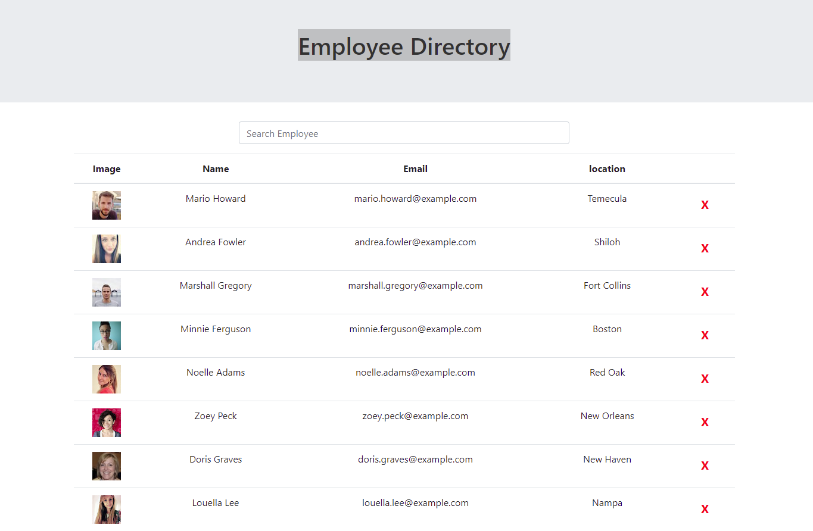

# Employee Directory            

## Table of Content:
1.[Description](#Description)

2.[Installation Instructions](#Installation-Instructions)

3.[Usage Information](#Usage-Information)

4.[License](#License)

5.[Questions](#Questions)

## Description:
An employee dircotry that would allow a manager to get non-senstive information about company's empolyees, this directory is made with ReactJs

## Installation Instructions:
* install the lastest nodeJS 
* run "npm i" to install dependecies 

## Usage Information:
* visit [employee directory](https://laithalwani.github.io/employee-directory/) 
* from the list of employees you can sort the employees by name or location in ascending or descending order 
* search for an employee using the serch bar
* delete an employee

## License:
This application is covered under the .    

## Questions:
* Github: [laithalwani](https://github.com/laithalwani)
* laithalwani@gmail.com